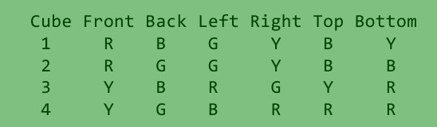

# CubePuzzle

You have four colored cubes. 
Each side of each cube is a single color, and there are four colors: 
blue (B), red (R), green (G) and yellow (Y). 

Describing the six faces as front, back,
left, right, top, bottom, the cube colors are: 

The objective is to find ways to stack the four cubes as a vertical column 
so that each side of the column is showing all four colors. 

Valid input: "RBGYBY,BGYGRB,GRRBYG,YYBRGR" 
Invalid input: "RBGYBY,RGGYBB,YBRGYR,YGBRRR"

